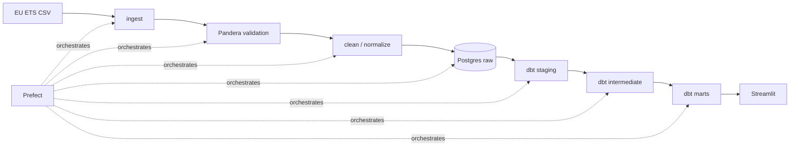

# EU ETS Emissions Pipeline

[](https://github.com/defnalk/energyemissions/actions/workflows/ci.yml)

A production grade ETL pipeline for EU Emissions Trading System data:
**Pandera validated ingest → Postgres `raw` → dbt staging/intermediate/marts →
Streamlit dashboard**, orchestrated by Prefect, packaged in Docker Compose,
and tested end to end against an ephemeral Postgres via testcontainers.

## Architecture



See [`docs/architecture.md`](docs/architecture.md) for details.

## Setup

```bash
cp .env.example .env
make up        # start postgres + prefect-server + worker + streamlit
make seed      # run the flow once to populate the warehouse
make test      # pytest + dbt build --target test
make lint      # ruff + format check
```

Open:

- Streamlit dashboard: <http://localhost:8501>
- Prefect UI:          <http://localhost:4200>
- dbt docs:            `make dbt-docs` then <http://localhost:8080>

## Data source

The pipeline reads the public EU ETS verified emissions dataset from the
European Environment Agency
([data hub](https://www.eea.europa.eu/en/datahub/datahubitem-view/9d04d6c1-d8cf-44ff-aa5e-c1c5f8c7c9de)).
Because that URL is unstable, the repo also bundles a deterministic
~50k row synthetic sample (`warehouse/seed/generate_sample.py`) matching the
EUTL schema. Toggle with `USE_LOCAL_FALLBACK=true|false`.

## Layout

```
ingest/         # download, schemas, bulk COPY loaders
transform/     # cleaning + enrichment helpers
warehouse/     # SQL migrations + seed CSVs
dbt_project/   # staging/intermediate/marts + tests + macros + snapshots
orchestration/ # Prefect flows, tasks, schedules, alerts
dashboard/     # Streamlit multipage app
tests/         # pytest with testcontainers Postgres
```

## What I'd add in production

- **Monitoring**: Prometheus exporter on the Prefect worker; Grafana
  dashboards on flow duration, row counts, and `raw.rejected_rows` growth;
  PagerDuty alerts driven by `orchestration.alerts.send_alert`.
- **CDC**: switch from full truncate and load to Debezium based change data
  capture against the upstream EUTL Postgres mirror, materialised into
  partitioned `raw.*` tables.
- **Partitioning**: time partition `raw.emissions` and `mart.*` by `year`
  with declarative partitioning; convert dbt marts to incremental on
  `(installation_id, year)`.
- **RBAC**: separate Postgres roles for `etl_writer` (raw + staging),
  `analyst` (mart read only), and `app` (mart read only with row level
  security on `country_code` for tenant scoping).
- **Secrets**: pull DB credentials from Vault / AWS Secrets Manager via the
  Prefect block system rather than `.env`.
- **Data contracts**: publish the Pandera schemas as a versioned package
  consumed by upstream producers; gate dbt builds on contract diffs.

## Documentation

- [`docs/architecture.md`](docs/architecture.md)
- [`docs/data_dictionary.md`](docs/data_dictionary.md)
- [`docs/runbook.md`](docs/runbook.md)
