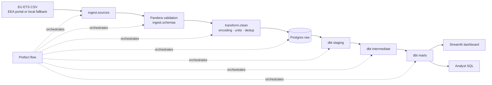

# Architecture

The pipeline is a single Prefect flow (`orchestration.flows.energy_pipeline`)
that fans out per source table, validates each row with Pandera, applies
Python-side cleaning, bulk-COPYs into the `raw` schema, then hands off to dbt
for staging → intermediate → marts. Streamlit reads exclusively from `mart.*`.
